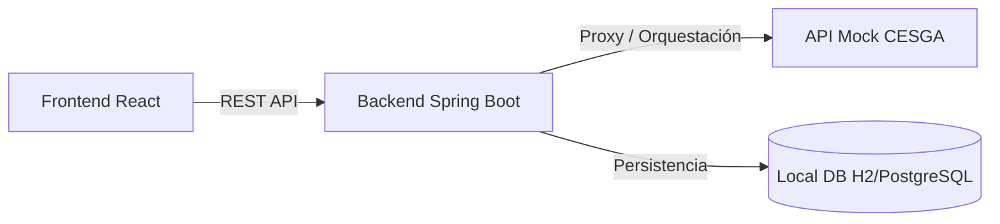

# LocalFold - Plan de Implementación

Construiremos "LocalFold", la plataforma web diseñada para democratizar el plegamiento de proteínas, interactuando con la API mock del CESGA. 
Tal como has solicitado, la arquitectura tendrá un backend propio en **Spring Boot (Java)** y un frontend en **React (Vite)**.

## Arquitectura General

El **Backend Spring Boot** actuará como intermediario (BFF - Backend For Frontend). Sus responsabilidades serán:
1. Recibir las secuencias FASTA del frontend y enrutarlas a la API del CESGA.
2. Guardar un histórico local de los "Jobs" enviados por el usuario utilizando una base de datos embebida (como H2).
3. Añadir capas de valor (ej: integración con LLMs para resumir resultados de pLDDT / PAE).
4. Resolver problemas de seguridad o CORS aislando la API final del cliente.

El **Frontend React** será la "última milla". Aspectos visuales Premium con Vanilla CSS (colores oscuros, animaciones fluidas) y focalizados 100% en la UX del investigador.

---

> [!IMPORTANT]  
> **Revisión Requerida**  
> He optado por sugerir **Vanilla CSS** con variables y un sistema de diseño propio para el Frontend con el fin de generar un resultado con un alto nivel estético (aspecto premium), tal y como requiero en mis directrices base. Si el equipo prefiere imperativamente **TailwindCSS**, por favor indícamelo en los comentarios de revisión.

## Proposed Changes

### Backend (Spring Boot)
Inicializaremos el proyecto en la ruta `/Back-End/` (presumiblemente con Maven) incluyendo dependencias Web, JPA y H2.
- **Controladores**: 
  - `POST /api/jobs/submit`
  - `GET /api/jobs/history`
  - `GET /api/jobs/{id}/status`
  - `GET /api/jobs/{id}/outputs`
- **Servicios**: `CesgaApiClientService` ejecutará peticiones HTTP (`RestTemplate` o `WebClient`) hacia `https://api-mock-cesga.onrender.com`.
- **Entidades**: Almacenar el `Job` (Job ID, fecha de creación, archivo fasta, status final).

### Frontend (React / Vite)
Trabajaremos sobre el directorio actual `/Front-End/`.
#### [NEW] `src/services/api.ts`
Capa de conexión contra nuestro Backend `localhost:8080`.
#### [NEW] `src/components/MoleculeViewer.tsx`
Componente wrapper para visualizar la molécula en 3D (integrando la librería Mol* `molstar` o `3dmol`). Permitirá colorear partes de la proteína según la variable pLDDT de confianza.
#### [NEW] `src/pages/JobSubmit.tsx`
Vista inicial con un gran campo de texto estilizado para introducción de secuencias FASTA y selectores de presets.
#### [NEW] `src/pages/JobResults.tsx`
Dashboard analítico espectacular que contenga:
- Visor 3D.
- Heatmap de PAE generado posiblemente a través de Canvas / gráficos SVG genéricos o Canvas.
- Tarjetas de resumen de metadatos (Solubilidad, CPU accounting).

## Open Questions

> [!WARNING]  
> Por favor, respóndeme a estas tres cuestiones para proceder correctamente a ejecutar el plan:

1. **Gestor de dependencias Java**: ¿Queréis usar `Maven` o `Gradle` para inicializar el proyecto base de Spring Boot?
2. **Versión de Java**: Asumo que dispones de la versión 17 o 21 localmente instalada en tu sistema. ¿Puedes confirmarme cuál utilizaremos?
3. **Persistencia / Base de Datos**: Propongo `H2` (en memoria/fichero local) para ser rápidos en el tiempo de la Hackathon. ¿Os encaja bien?

## Verification Plan

1. **Arranque Backend**: Iniciar Spring Boot y comprobar que el endpoint de estado responde y conecta con el CESGA Mock en internet.
2. **Arranque Frontend**: Iniciar React y ver la UI.
3. **Flujo E2E**: Pegaremos una secuencia FASTA, veremos entrar el job a la cola y finalmente cargar la vista 3D.
